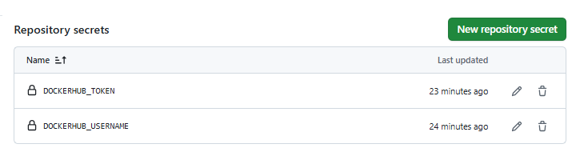
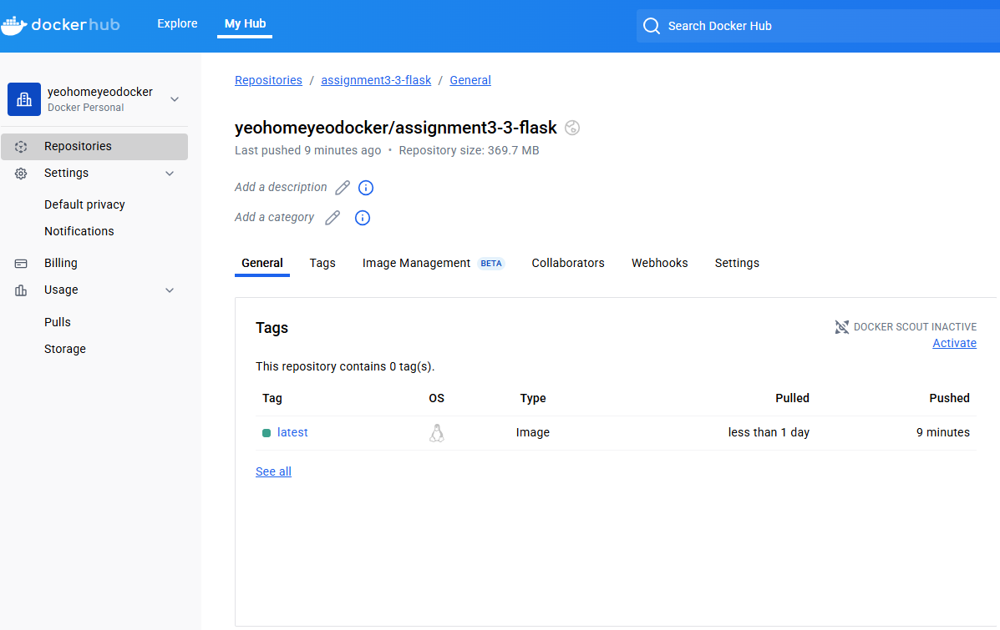

# Assignment3-3
Introduction to containers

## Github secrets to store docker credentials

## Docker in Dockerhub repository

## Workflow enabling build then push to dockerhub
//

      name: Docker Build and Push to DockerHub
      
      on:
        push:
          branches: [ "main" ]  # Triggers on push to main
      
      jobs:
        build-and-push:
          runs-on: ubuntu-latest
      
          steps:
            - name: Checkout code
              uses: actions/checkout@v4  # Checkout Flask app code
      
            - name: Set up Docker Buildx
              uses: docker/setup-buildx-action@v3  # Optimized Docker build setup
      
            - name: Login to DockerHub
              uses: docker/login-action@v3
              with:
                username: ${{ secrets.DOCKERHUB_USERNAME }}
                password: ${{ secrets.DOCKERHUB_TOKEN }}
      
            - name: Build and Push Docker Image
              uses: docker/build-push-action@v6
              with:
                context: .  # Path to Dockerfile
                push: true  # Push to registry after build
                tags: |
                  ${{ secrets.DOCKERHUB_USERNAME }}/assignment3-3-flask:latest
//
